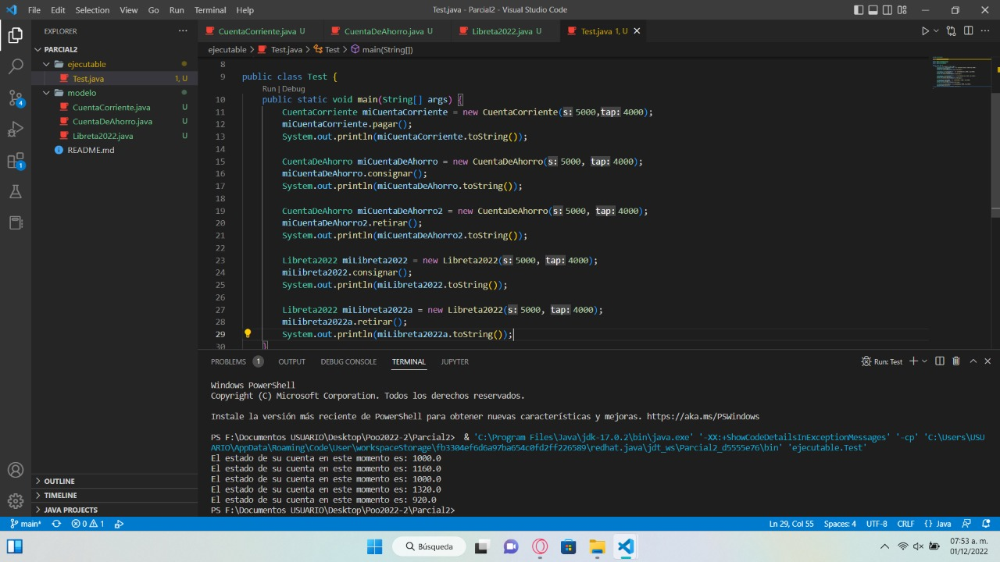

# Parcial2
En un banco se tienen varios tipos de cuentas bancarias en las cuales es posible retirar fondos y hacer depósitos. Consideremos tres tipos de cuentas: cuenta corriente, de ahorro, y libreta 2022. Las cuentas corrientes se utilizan para realizar pagos y no proporcionan ningún interes. Por otro lado, las cuentas de ahorro proporcionan un interés del 4%. La libreta 2022 es un tipo de cuenta de ahorro que rinde un mayor interés (del 8%) pero la retirada de fondos está penalizada con un 2% de la cantidad retirada.

